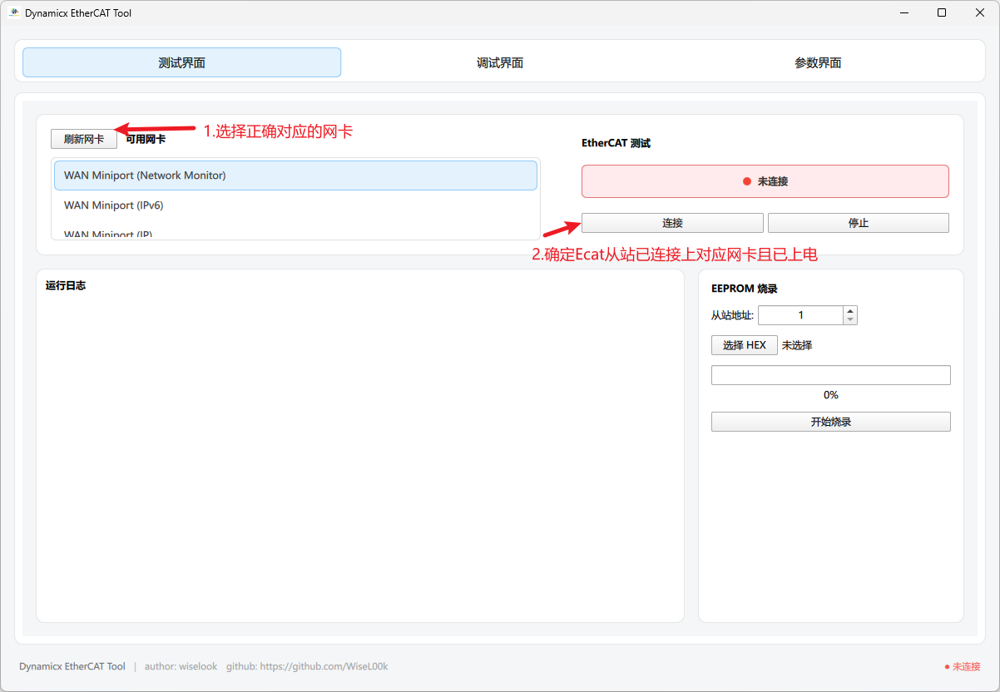
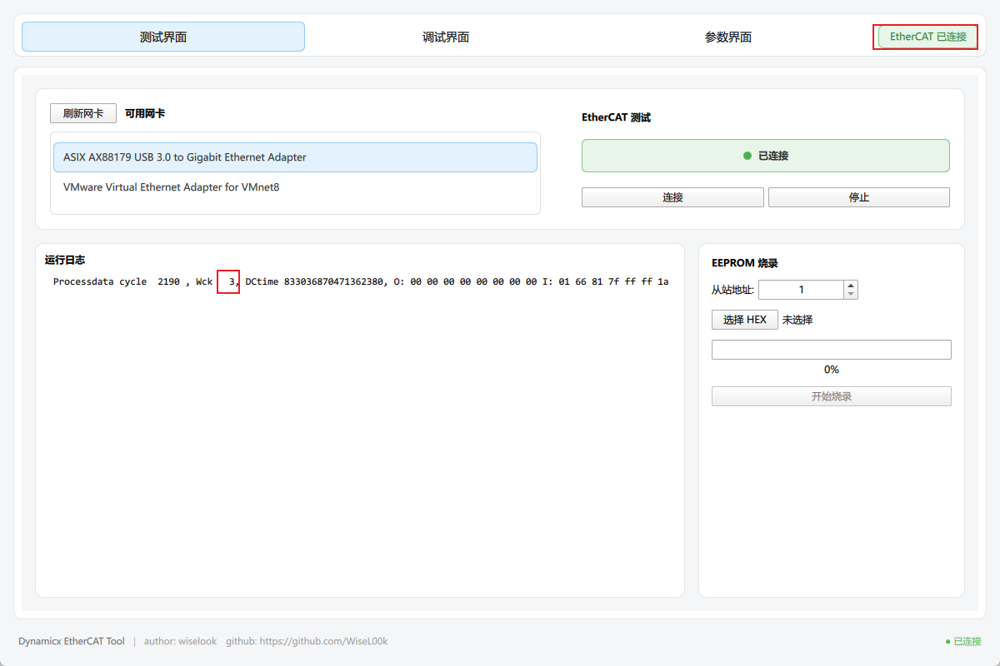
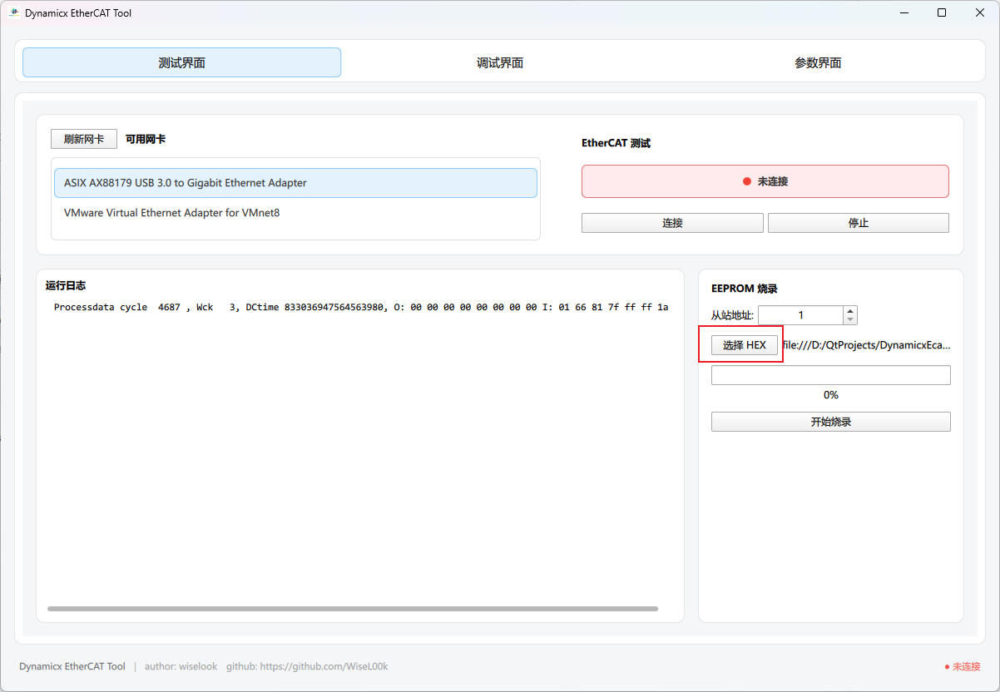
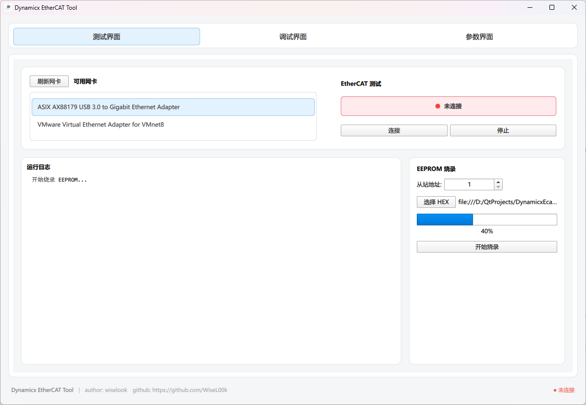
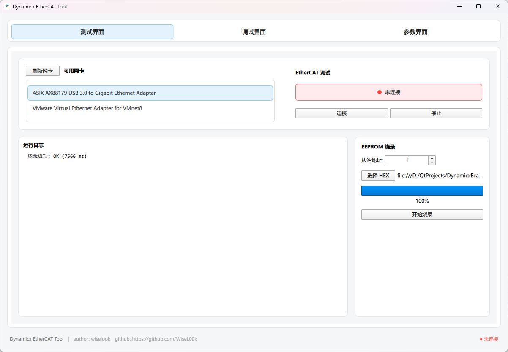

# 测试界面介绍

主要用于验证Ecat从站能否构建起**主从站通信循环**以及**从站EEprom的烧录**

打开软件第一个界面便是测试界面

## 主从站通信循环测试

连接成功，此时wck应为3，若不为3，可考虑网线是否松动，ecat从站电源是否稳定，尝试重新插拔连接。

从站灯板ONLINE灯常亮

## 从站EEprom的烧录

烧录从站EEprom时，不需要点击连接从站按钮

先选择好对应的网卡，连接上Ecat从站，确保Ecat从站供电

再需要选择好正确的HEX文件，点击开始烧录按钮即可

等待几秒，提示烧录成功即可。

