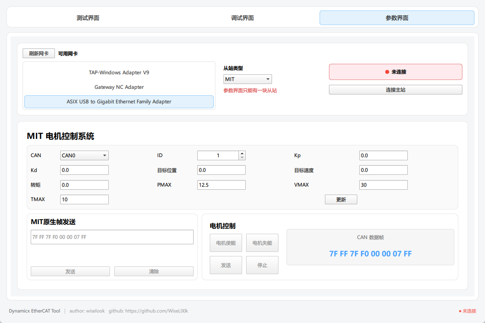
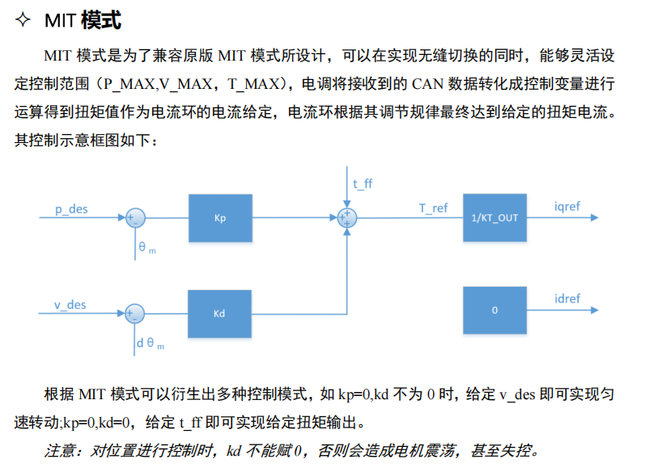
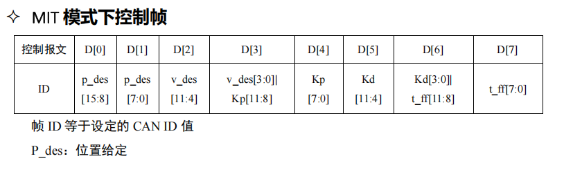
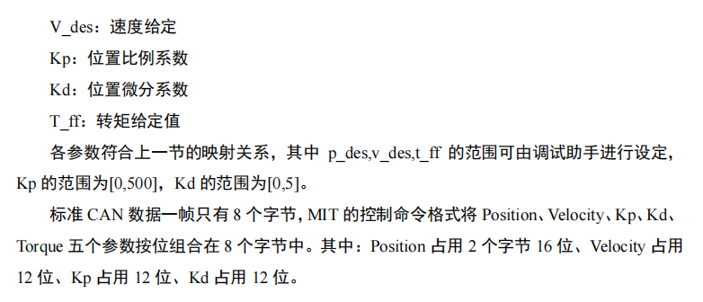
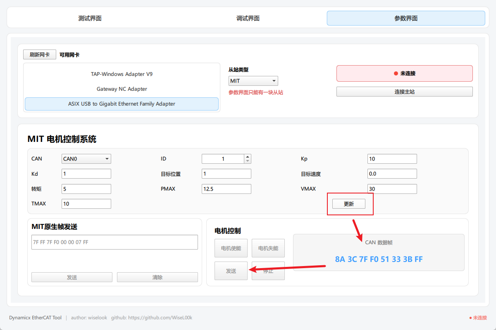

# 参数界面介绍

主要用于测试达妙电机参数，电机需要设置为MIT模式

只支持挂载一个MIT从站

## 驱动电机

驱动电机可参考以下方式，发送原生帧

***注：驱动电机前，必须先使能电机***

点击电机使能，会使能该CAN上所有电机，失能同理

点击更新按钮，可更新**电机控制**面板下的CAN数据帧，点击该面板的发送，即可发送该帧到对应电机

***ps：按钮在主站未连接上从站前都处于失能状态，无法点击。***

> MIT模式参考自[达妙电机官方文档](https://gl1po2nscb.feishu.cn/wiki/MZ32w0qnnizTpOkNvAZcJ9SlnXb?fromScene=spaceOverview))